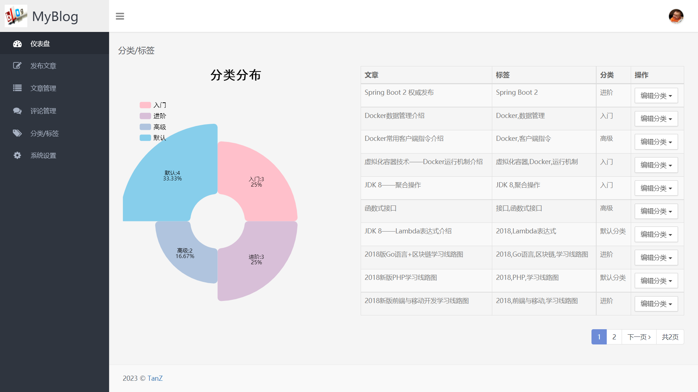

### blog_system

# 《博客系统》源码使用文档
   
  
  0.配置材料信息：JDK1.8, MySQL8.0, Redis
  
  1.源码文件中的application.yml，第二行的port端口，必须得是不被占用的；

  2.application-jdbc.properties中的MySQL账号和密码需要和自己本地一致；

  3.config包下的RedisConfig类,我添加在@Bean下@SuppressWarnings("all")，
是用来避免RedisConnectionFactory报错的；

  4.初次引入项目需要修改Settings中的Build,Execution,Deployment下的Build Tools下的
Maven中的settings.xml和repository文件夹与本地路径一致；

  5.blog_system.sql直接拖进Navicat就行，会生成对应的数据库，确保数据库存在再运行。
  
  6.QQ邮箱记得改啊（application-mail.properties），
如果要测试邮件是否能发送，可以直接看Text类的注释，运行测试类就行;

  7.resources文件夹在IDEA中需要手动改个格式（具体如图所示）：

 

##### 主要内容

（1）在dao目录下封装有主要的sql语句。

（2）在model目录中的domain目录将要获取到的表中的属性进行封装；ResponseData目录封装

前端请求响应的类和统计服务类，ResponseData目录下的utils目录主要文章网站连接，邮件发送

工具类，文章处理工具类。

（3）在service目录中有封装主要方法的接口，service目录下的impl目录对接口进行实现，并对

传过来的数据经行处理。

（4）在web目录下的admin目录的类是来解析用户的输入的内容，并把数据通过request传给前端；

web目录下的client目录的类时处理前台的内容，包括评论操作、文章内容以及登陆界面；web目录下

的interceptor目录下的类用于自定义的Interceptor拦截器类，用于封装请求后的数据类到request域中，供html页面使用。

（5）在resources目录下的i8n目录存放国际化搜需要的文件，其中logo_en_US.properties为英文，logo_zh_CN.properties为中文。

（6）在resources目录下存放css样式、图片以及js文件

（7）在resources目录下templates目录下有三个目录，其中back目录存放的时后台的html文件；client

目录存放的时前台的html文件；comm目录存放的网页出错显示文件。

 

### 网页内容展示

#### <u>1.博客首页</u>

#### <u>2.登陆界面</u>

#### <u>3.仪表盘</u>

#### <u>4.发布文章</u>

#### <u>5.文章管理</u>

#### <u>6.评论管理</u>

#### <u>7.分类标签</u>

#### <u>8.系统设置</u>

#### <u>9.文章页面</u>

#### 10.邮件发送

根据Test类中的注释信息去操作，可以做到邮件发送（在QQ邮箱中查收）

